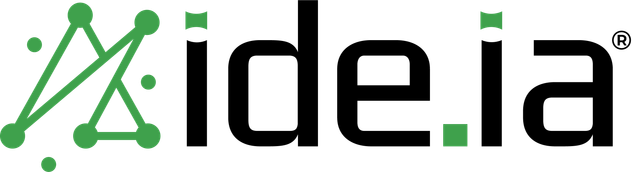

# IDE.IA — Slides

Esta skill produz **slides**, e só slides. O IDE.IA é um laboratório de pesquisa
em IA ("laboratório"). Idioma padrão: **português do Brasil**. Handle: `@ide.ia_`.

A identidade já está decidida — dois verdes, quina viva no claro, cartão
arredondado no escuro, Urbanist, padrão de rede, sem sombra, sem emoji. Seu
trabalho não é inventar um visual: é executar este com precisão e impedir que
ele vire "SaaS verde genérico".

## Como usar

1. **Descubra o que é o deck**: assunto, quem assiste, quantos slides, e claro ou
   escuro. Se o pedido não disser, escolha e declare a escolha em uma linha.
2. **Escreva o roteiro antes do HTML** — uma linha por slide, no formato
   `layout · afirmação do slide`. É aqui que o excesso de informação é cortado,
   e é muito mais barato cortar agora do que depois de codar.
3. **Leia `references/layouts.md`** e monte cada slide dentro dos espaços do
   layout escolhido. Esse arquivo tem a tabela de decisão, os limites de palavras
   e o HTML de cada layout.
4. **Consulte `references/marca.md`** quando a decisão de cor, ícone, logo ou voz
   não estiver óbvia.
5. **Parta de `examples/deck-exemplo.html`.** Mantenha o `<style>` inteiro e os
   `src="data:image/..."` como estão, e substitua só as `<section class="slide">`
   pelo seu conteúdo. É a única forma de o deck sair estilizado.
6. **Rode a verificação** do fim deste arquivo antes de entregar.

## O deck tem que ser autocontido

**Nunca gere um deck com `<link rel="stylesheet" href="styles.css">`.** Esse
caminho só resolve dentro da pasta da skill. Num artifact, num anexo, ou num
arquivo aberto na máquina de outra pessoa, o CSS não carrega e o HTML abre
completamente cru — sem cor, sem tipo, sem layout. O mesmo vale para
`src="assets/..."`: as imagens somem.

`examples/deck-exemplo.html` já é autocontido: CSS inteiro num `<style>` e todos
os assets em data URI, num arquivo só de ~240KB. **Copie esse arquivo e troque o
conteúdo dos slides.** Não reescreva o `<style>`, não converta os data URIs de
volta em caminhos, não extraia o CSS para fora.

Para um asset que o exemplo não usa, embuta em data URI também — ou rebuilde com
`python3 build/build-template.py`, que regenera o exemplo a partir de
`build/deck-fonte.html`, dos tokens e dos assets.

## Modos

- **Claro** — fundo branco, texto quase preto, **quina viva**, menta em grandes
  preenchimentos, verde folha em detalhes, ícones finos (`assets/icons/`).
  Institucional, aula, divulgação. **Padrão.**
- **Escuro** — fundo navy, texto branco, **cartões arredondados**, ícones
  grossos em menta (`assets/icons-dark/`). Técnico, proposta, comparação, dado.

Um modo por deck. A divisória menta funciona nos dois. Nunca misture os dois
conjuntos de ícone nem os dois regimes de quina no mesmo slide.

## Regras duras

**Conteúdo**

- **Uma ideia por slide.** Título com "e" no meio geralmente são dois slides.
- **Se não couber nos espaços do layout, vira outro slide.** Diminuir o corpo de
  texto para caber é proibido — é a origem do slide entulhado.
- Título de slide: **máximo 8 palavras**. Bullets: **no máximo 3**, de até 12
  palavras cada. Parágrafo: até 40 palavras. Um bloco por slide, nunca
  parágrafo *e* bullets.
- **Um número por slide de dado.** Dois números competem e nenhum é lido.
- Estrutura tem que significar algo: sobrelinha marca seção real, régua separa
  coisas realmente distintas, e o algarismo fantasma só entra em sequência real
  (etapa 01/02/03), nunca em itens paralelos.

**Ocupação — o piso que impede o slide vazio**

- O conteúdo tem que ocupar **pelo menos 75% da altura e 80% da largura** da
  área. Abaixo disso o slide lê como pequeno mesmo com a fonte grande: é o vazio
  em volta que define a escala percebida, não o `font-size`.
- **Coluna única, hierarquia vertical, largura cheia.** Sobrelinha, título,
  régua e conteúdo empilhados, cada bloco ocupando a largura inteira da área.
  Nada de grade de duas colunas, e nada de texto preso a uma medida estreita na
  metade esquerda.
- Exceções ao piso: divisória e encerramento. Nos dois o preenchimento vem da
  banda de cor e do padrão de rede, não da quantidade de texto.
- **Título de até 5 palavras usa `.display`, não `.titulo`.** Título curto numa
  linha só, boiando no branco, é a causa número um de slide subdimensionado.
- Prosa e contexto vão em `--t-prosa` (59px @1920), **justificados**. Numa coluna
  de largura cheia, texto em tamanho de parágrafo não preenche a altura e o slide
  volta a parecer vazio.
- Se mesmo assim sobrar metade do slide vazia, o problema é falta de conteúdo:
  junte com o slide vizinho em vez de esticar o que existe.

**Forma**

- Dois verdes, mais preto/branco/navy. Sem terceira matiz, sem gradiente.
- Claro: quina viva e sem sombra. Redondo só em cartão do modo escuro e badge de
  ícone.
- **Piso tipográfico: 26px no canvas de referência 1920** (`--t-caption`). Nada
  menor, em lugar nenhum.
- **O rótulo de seção é o título do slide** (`.eyebrow`, 92px, caixa de frase,
  verde). É ele que diz do que o slide trata. A frase abaixo (`.titulo`, 60px)
  é o **subtítulo**: ela desenvolve o rótulo, não compete com ele.
- Hierarquia de um slide de conteúdo, de cima para baixo: rótulo 92/800 →
  subtítulo 58/600 → corpo 48/400 → legenda 26. Cada nível cai em tamanho **e**
  em peso; dois pesos pesados empilhados brigam entre si.
- Exceção: capa e encerramento. Ali quem manda é o `.display` (134px), e a
  sobrelinha volta ao tamanho discreto de kicker (`--t-kicker`, 34px).
- Uma assinatura por slide (padrão de rede **ou** régua menta **ou** algarismo
  fantasma). As três juntas se anulam.
- **Logo só na abertura, na capa, nas divisórias e no encerramento.** Slide de
  miolo não leva logo.
- Se algum bloco parecer competir com o nível acima dele, o problema é quase
  sempre o texto estar longo demais — não o nível de cima estar pequeno.
- **O deck abre e fecha na marca:** `l-abertura` no primeiro slide (só o logo,
  escuro) e `l-encerramento` no último, também escuro.
- Sem emoji. Ícone é SVG da pasta `assets/`.
- **Tudo em caixa de frase**, inclusive o rótulo de seção. A caixa alta sobrou
  só no kicker pequeno da capa e do encerramento, e lá o CSS aplica sozinho.
  Nunca Title Case.
- Alinhamento: **tudo justificado.** `text-align: justify` + `hyphens: auto` vêm
  da `.area`, então todo texto do slide herda. A divisória é a única exceção,
  porque é centrada.
- Justificação só age em linhas que não são a última, então elementos de uma
  linha só (rótulo, legenda, contatos, célula de tabela) ficam iguais na prática.
- O documento precisa de `<html lang="pt-BR">`. Sem o `lang`, o navegador não
  carrega o dicionário de hifenização e a justificação abre vãos enormes entre
  as palavras. É o erro que mais estraga um slide justificado.

## Escala e canvas

Todo slide tem dois níveis. A classe do layout vai na `.area`, o modo vai na
`.slide`, e o que sangra fica fora da `.area`:

```html
<section class="slide">            <!-- + .dark ou .accent -->
  <div class="area l-capa"> … </div>
  
</section>
```

A `.slide` é 16:9, de largura fluida, e serve de container de consulta. Toda
medida interna está em `cqw` — 1cqw é 1% da largura do slide, ou 19,2px no canvas
de referência de 1920. Por isso o deck é idêntico em miniatura, em artifact e
projetado.

**Nunca ponha padding na `.slide`.** `cqw` resolve contra a caixa de conteúdo do
container, então padding em `cqw` nela mesma é circular: o navegador devolve um
valor diferente do escrito, e layouts com padding distinto acabam com escalas de
texto distintas. A margem do slide vive na `.area`.

**Não use `vw` em slide.** `vw` mede a janela, não o slide: num preview estreito
o título "display" encolhe até o mínimo e o deck inteiro parece pequeno. Se
precisar de um tamanho que não está na escala, derive em `cqw` a partir do valor
em 1920 (`px ÷ 19,2`).

Escala disponível (valor no canvas 1920): `--t-display` 134 · `--t-title` 58 ·
`--t-lead` 49 · `--t-prosa` 48 · `--t-body` 36 · `--t-eyebrow` 92 · `--t-kicker` 34 · `--t-caption` 26 ·
`--t-metric` 346 · `--t-ghost` 134.

**Bullet vai em `--t-lead`, não em `--t-body`.** Num slide o bullet é o conteúdo
principal; `--t-body` é para parágrafo corrido. A classe `.bullets` dentro de
`l-titulo-texto` já faz isso sozinha.

## Fontes

**Urbanist, uma só família**, carregada do Google Fonts dentro de
`tokens/typography.css`. Não existe fonte substituta e não existe segunda
família de corpo — o contraste vem de peso, tamanho e caixa.

Para deck offline ou exportação sem rede, importe `fonts/urbanist-local.css`
**depois** de `styles.css` e leve a pasta `fonts/` junto. Se os `.ttf` ficarem
para trás, a fonte falha em silêncio e cai no fallback.

## O que a skill traz

| Caminho | O que é |
|---|---|
| `styles.css` | Import único: cores, tipo, canvas, layouts. |
| `references/layouts.md` | **Leia antes de montar** — tabela de decisão, orçamento de conteúdo e HTML dos 8 layouts. |
| `references/marca.md` | Referência completa: paleta, tipo, forma, ícones, logo, voz. |
| `examples/deck-exemplo.html` | Deck completo e **autocontido**. Copie daqui e troque o conteúdo. Arquivo derivado — não edite à mão. |
| `build/` | `deck-fonte.html` (o HTML editável) e `build-template.py`, que embute CSS e assets e regenera o exemplo. |
| `tokens/` | `colors.css`, `typography.css`, `canvas.css`. |
| `layouts.css` | As oito classes de layout e os elementos da marca. |
| `assets/logo/` | Logos SVG (`svg/01–10.svg`) e PNG. Use sempre `ideia-logo-full.png` — a versão branca entra sozinha no escuro, e o CSS só exibe o logo na capa, nas divisórias e no encerramento. Índice em `assets/logo/README.md`. |
| `assets/icons/` · `assets/icons-dark/` | **Coleções diferentes, não o mesmo ícone em dois estilos.** 21 no claro, 9 no escuro, nomes sem correspondência. Confira o inventário em `references/marca.md` antes de escolher. |
| `assets/patterns/` · `assets/illustrations/` | Padrão de rede e imagens de apoio. |
| `fonts/` | Urbanist local (opcional) + licença OFL. |
| `NOTICE.md` | Licenciamento. Leia antes de distribuir. |

## Verificação antes de entregar

Passe o deck por esta lista. Ela é curta de propósito — são os erros que
realmente acontecem.

1. **Conteúdo** — algum slide passa dos espaços do seu layout? Algum tem mais de
   3 bullets, mais de um número, ou parágrafo *e* lista? Divida.
2. **Ocupação** — algum slide usa menos de 75% da altura? Se sim: o título é
   curto e devia estar em `.display`, ou falta conteúdo e ele devia se juntar ao
   vizinho.
3. **Autocontido** — o arquivo tem `<style>` com o CSS inteiro? Sobrou algum
   `<link>` de CSS ou `src="assets/..."`? Se sobrou, o deck abre sem estilo na
   mão de quem receber. É o erro mais grave da lista.
4. **Tamanho** — algum texto abaixo de 26px no canvas 1920? Algum `vw` ou `px`
   fixo escapou onde devia ser `cqw`?
5. **Fonte** — a Urbanist carregou mesmo? Se os títulos parecem estreitos ou com
   desenho de fonte de sistema, o `@import` do Google Fonts não subiu.
6. **Marca** — só dois verdes? Alguma sombra ou quina arredondada escapou no modo
   claro? Os dois conjuntos de ícone se misturaram? Emoji? Todo `src` de ícone
   existe mesmo na pasta que você citou?
7. **Assinatura** — mais de uma por slide? Algum algarismo numerando coisas que
   não são sequência? Alguma régua que não divide nada?
8. **Ritmo** — mais de 6 slides seguidos sem divisória, dado ou imagem? O deck
   está monótono mesmo respeitando todas as regras.

Se puder renderizar e olhar, olhe: um print resolve em segundos o que a leitura
do HTML não pega.
